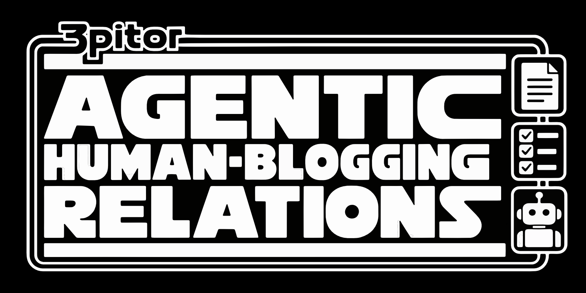

# 3pitor



An editor for blog posts written in markdown, with Claude built in. You edit posts in a rich text editor and work on
them with Claude in a chat panel, with tool approvals.

It is built on Bun + TypeScript, Hono, and the Vercel AI SDK (v7) with its Anthropic provider, which calls the Anthropic
API directly. It needs no `claude` program.

All code lives in `src/`.

- `src/server/` is split by feature. Each feature has a domain file that knows nothing about HTTP, plus a matching
  `*.routes.ts` file with its Hono routes:
  - `sessions.ts`: chat turns and cancelling.
  - `approvals.ts`: tool-use approvals.
  - `events.ts`: the event bus. Its routes file is the WebSocket.
  - `documents.routes.ts` and `workspace-config.routes.ts`: routes only.
- Shared pieces in `src/server/`:
  - `agent-host.ts` wires the features together.
  - `agent.ts` builds each chat turn's model, instructions, and tools, including the `Task` tool that runs
    subagents.
  - `tools.ts` holds the model's file tools (Read, Write, Edit, Glob), which cannot reach outside the workspace and
    only change markdown posts.
  - `workspace-config.ts` loads the workspace's skills and agents from `.claude/`, plus the code-defined agents.
  - `workspace.ts` seeds the document workspaces.
- `src/server/server.ts` is the entry point. It mounts every feature's routes on one Hono app. The app serves REST
  endpoints, the AI SDK UI message stream (SSE) for chat, and a Bun-native WebSocket for events.
- `src/shared/wire.ts` holds the event types that the server, the UI and the check script share.
- `src/shared/markdown-support.ts` holds the one piece of runtime code both sides share: the check for markdown the
  editor can't keep (tables, task lists, raw HTML). Like `wire.ts`, it has no imports.
- `src/server/scripts/` holds the end-to-end check.
- `src/ui/` is a small React page built on the AI SDK's `useChat`. Bun bundles it from `src/ui/index.html`, so there is
  no separate build step. Each feature has one file, with its CSS next to it:
  - `documents.tsx` has the document list and editor pane. It keeps every file opened since the page loaded, so
    switching files keeps unsaved edits, and the browser warns before leaving the page with any unsaved.
  - `markdown-editor.tsx` is the ProseMirror rich text editor, bound to a Yjs document per file so edits made elsewhere
    merge with the user's typing.
  - `chat.tsx` is the chat panel with approval cards.
  - `agent-panel.tsx` shows the workspace's skills and agents.
  - `api.ts` and `host-events.ts` are the shared fetch helper and the host-event WebSocket.
  - `app.tsx` is the entry point. It is the only file that wires features together, and `styles.css` holds the base styles.
- `src/fixtures/workspace` is the document workspace, with a project skill (`doc-stats`) and a filesystem agent
  (`proofreader`). A second agent (`title-writer`) is defined in code.

## Run it

```sh
bun install
make test              # unit tests for the server and the UI; no API key needed
make test-server       # only the server and shared tests (src/server, src/shared)
make test-ui           # only the UI tests (src/ui/**/*.test.tsx), in a simulated browser page (happy-dom)
bun run check          # resets its own workspace, starts a server, runs every scenario
bun run check skill    # run only scenarios whose name contains "skill"
bun run server         # run the server and UI; it prints its URL (a random free port)
```

The server picks a random free port each time, so you can run several at once. Set `PORT` to use a fixed one, for
example `PORT=3737 bun run server`. It opens the UI in your default browser once it starts; set `OPEN_BROWSER=0`
to skip that.

`bun run server` uses `src/.data/workspace`, copied from the fixtures on first start. Delete that folder to reset it.
`bun run check` uses its own `src/.data/check-workspace`, so it won't disturb a running server.

## Build it

```sh
make build             # compiles everything into build/3pitor
./build/3pitor         # the workspace is the folder you launch it from
./build/3pitor my-stuff        # the workspace is the my-stuff folder
./build/3pitor my-stuff/a.md   # the workspace is the folder that holds a.md
make clean             # deletes build/
```

`build/3pitor` is a single executable with the server and UI inside it, and nothing else in `build/`. If the folder or
file you name does not exist, it warns and uses the launch folder. `bun run server` takes the same argument, for
example `bun run server ~/notes`. The built app has no fixtures to seed a workspace, so setting `WORKSPACE` to a folder
that doesn't exist fails.

Set `ANTHROPIC_API_KEY` to sign in; the server warns at startup when it is missing. Set `MODEL` to change the model: a
full model id, or one of the shortcuts `haiku`, `sonnet`, and `opus`. The default is `claude-sonnet-5`.

## Endpoints

| Method | Path | Purpose |
| --- | --- | --- |
| GET/PUT | `/api/documents/:name` | Load or save a markdown file in the workspace |
| POST | `/api/sessions` | Create a chat session |
| POST | `/api/sessions/:id/chat` | Send a message; responds with an AI SDK UI message stream |
| POST | `/api/sessions/:id/cancel` | Cancel the running turn |
| POST | `/api/approvals/:id` | Answer a tool approval: `{ "allow": true }` |
| WS | `/ws/events` | Approval requests and task events; approvals can be answered here too |
